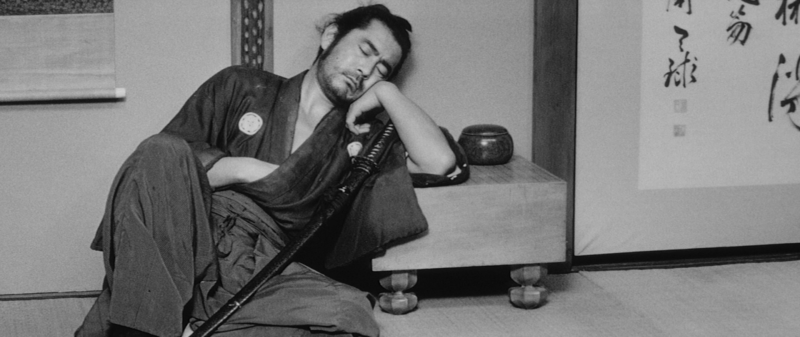

**Films**

For no particular reason, here is a list of films which I've enjoyed (Chronological order)

- Metropolis *1927*

- Yojimbo (用心棒) *1961*

- The Sword of Doom (大菩薩峠) *1966*

- Solaris (Солярис) *1972*

- The Godfather *1972*

- Taxi Driver *1976*

- Akira (アキラ) *1988*

- Ghost in the Shell (攻殻機動隊) *1995*

- Maborosi (幻の光) *1996*

- The Eel (うなぎ) *1997*

- Amores perros *2000*

- Crouching Tiger, Hidden Dragon (卧虎藏龙) *2000*

- Billy Elliot *2000*

- Tokyo Godfathers (東京ゴッドファーザーズ) *2003*

- A History of Violence *2005*

- Volver *2006*

- Alatriste *2006*

- 5 Centimeters per Second (秒速5センチメートル) *2007*

- A Christmas Tale (Un conte de Noël) *2008*

- Leviathan (Левиафан) *2014*

- Far from Men (Loin des hommes) *2014*

- Birdman or (The Unexpected Virtue of Ignorance) *2014*

- You Were Never Really Here *2017*

- Wrath of Silence (暴裂无声) *2017*

- Cold War (Zimna wojna) *2018*

- Pain and Glory (Dolor y gloria) *2019*